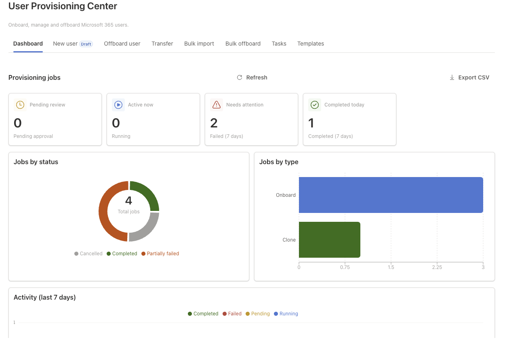
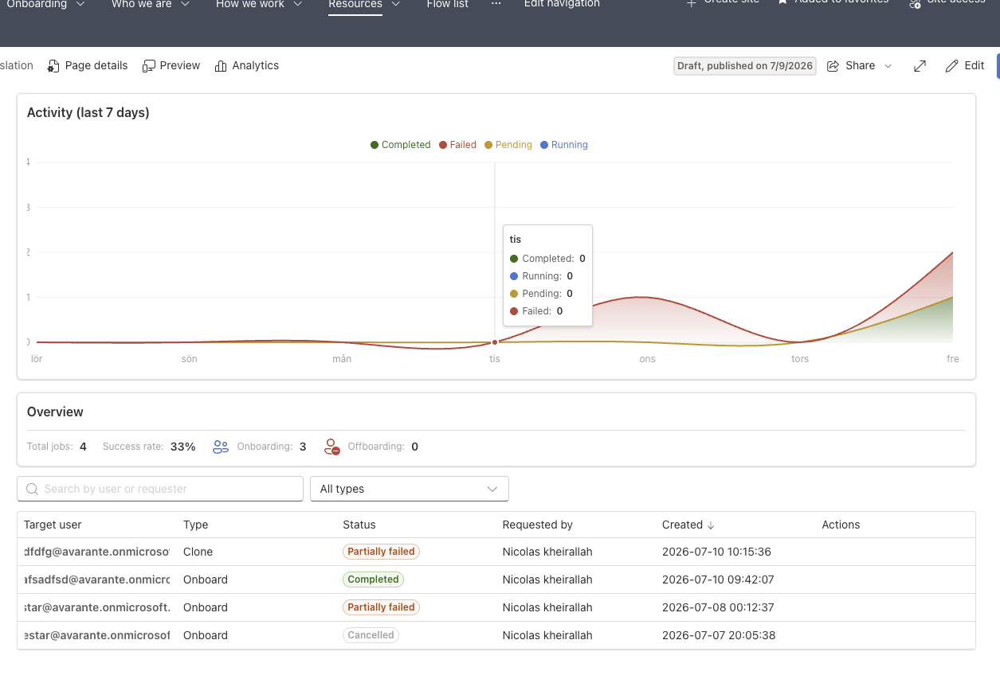
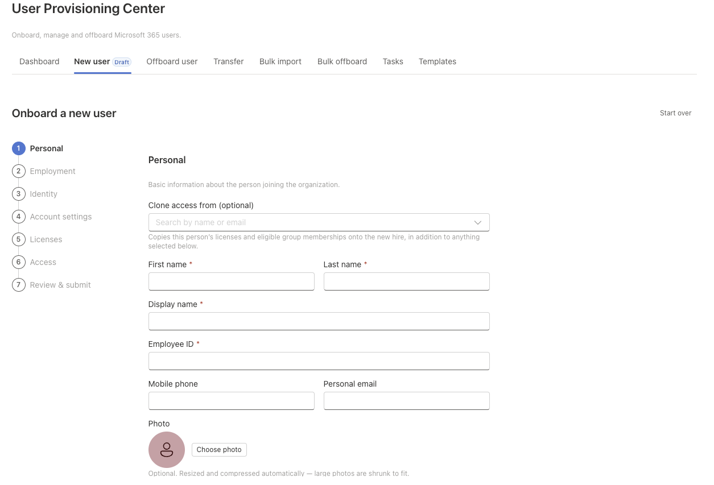
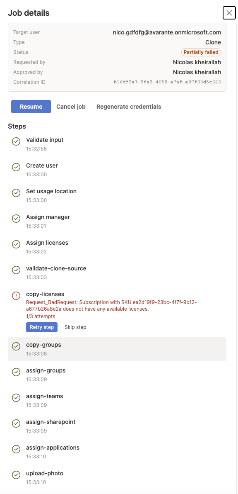

# User Provisioning Center

## Summary

SharePoint Framework web part for running employee onboarding, transfers and
offboarding out of Microsoft 365 — no Azure Functions, no custom backend.
Every operation is a delegated Microsoft Graph call made from the browser
under the signed-in operator's own permissions; job state, tasks, templates
and the audit trail all live in SharePoint lists (`UPC_*`) provisioned by the
solution itself. Anything Graph genuinely can't do from a client context
(converting a mailbox to shared, mail forwarding rules, OneDrive hand-over,
writes against hybrid-synced on-prem AD accounts) is routed to a service-desk
task instead of failing the job silently.

It ships as a normal SharePoint web part, a Teams tab, and a Teams personal
app — same code, same lists, three surfaces.

## Screen Demo



The dashboard hosted on a SharePoint page, with the job grid and live
activity chart:



The onboarding wizard's first step, with the optional clone-access picker:



The job detail drawer, showing per-step progress and an inline retry on a
failed step:



For the full permission model, the Entra role-to-permission matrix and the
residual-risk notes (what this app *cannot* enforce because it has no
backend), see [provisioning-assets/README.md](./provisioning-assets/README.md).
Treat that document, not this one, as the authoritative security reference
before you put this in front of real HR data.

## Compatibility

| :warning: Important |
|:---|
| Every SPFx version targets a specific Node.js range — check [the official compatibility table](https://learn.microsoft.com/en-us/sharepoint/dev/spfx/compatibility) before you `npm install`. This solution also runs **React 18** against SPFx 1.23, which officially ships React 17.0.1. That's a deliberate, documented deviation — read the [React 18 section](#-react-18-is-an-unsupported-configuration) below before you touch dependency versions. |


-Incompatible-red.svg)


Local workbench is listed unsupported for a practical reason, not a
theoretical one: the web part calls `msGraphClientFactory`, which the local
workbench can't provide a real token for, and the Fluent v9/SharePoint chrome
theming collision described [further down](#sharepoint-online--fluent-v9-gotcha)
never reproduces there either. Use the hosted workbench or a real page.

## Applies to

- [SharePoint Framework](https://aka.ms/spfx)
- [Microsoft 365 tenant](https://learn.microsoft.com/en-us/sharepoint/dev/spfx/set-up-your-development-environment)
- Microsoft Teams (tab and personal app)

> Get your own free development tenant through the [Microsoft 365 developer program](http://aka.ms/o365devprogram)

## Prerequisites

- A tenant admin who can approve API permission requests in the SharePoint
  admin center — this solution asks for eight delegated Graph scopes
  (`User.ReadWrite.All`, `GroupMember.ReadWrite.All`, `Organization.Read.All`,
  `Directory.Read.All`, `UserAuthenticationMethod.ReadWrite.All`,
  `Mail.Send`, `User.Invite.All`, `TeamMember.ReadWrite.All`) declared in
  [config/package-solution.json](./config/package-solution.json). None of this
  works until those are consented.
- [PnP PowerShell](https://pnp.github.io/powershell/) if you want to run
  `provisioning-assets/lists.ps1` instead of provisioning the `UPC_*` lists
  from the web part's property pane.
- Entra security groups to map onto the six app roles (ITAdmin, HRAdmin,
  DepartmentManager, ServiceDesk, Auditor, ReadOnly) — see the deployment
  checklist below.
- Node.js in the `>=22.14.0 <23.0.0` range (see `engines` in `package.json`).

## Contributors

- [Nico](https://github.com/NicolasKheirallah)

## Version history

| Version | Date | Comments |
| ------- | ---- | -------- |
| 0.0.1 | 2026-07-04 | Initial release |

## Minimal Path to Awesome

```bash
git clone <this repo>
cd user-provisioning-center
npm install --legacy-peer-deps   # required — see React 18 section
npm run start                    # local dev server + SPFx Debug Toolbar
```

The `--legacy-peer-deps` flag isn't optional cargo-culting here: `@microsoft/sp-core-library`
and `@microsoft/sp-webpart-base` declare a hard peer dependency on `react <18`,
and this project runs 18.3.1 anyway. A plain `npm install` will fail to
resolve. Details on why that's safe are below.

Before the app does anything useful you also need to provision the `UPC_*`
lists and seed the roles — see [Deployment checklist](#deployment-checklist).

## Features

| Surface | What it does | Visible to |
|---|---|---|
| **Dashboard** | KPI tiles that double as filters (pending approval, running, failed/completed last 7 days), search, type filter, sortable job grid with inline **Approve**, CSV export, a job drawer with live step progress, Run/Resume/Retry/Skip/Cancel, credential regeneration for completed jobs, and a per-job audit trail (also CSV-exportable) | everyone |
| **New user** | Seven-step onboarding wizard (Personal → Employment → Identity → Account → Licenses → Access → Review) with template pre-fill, live UPN candidates from the naming policy engine, duplicate-employeeId checks, per-section review edit links, guest invites (`/invitations` instead of a cloud account), an access grants step (security/M365 groups, Teams, SharePoint sites, applications), an optional future-dated access-review task, and the option to clone an existing user's access profile onto a new hire. Drafts survive tab switches; **Start over** discards them | everyone |
| **Offboard user** | Four-step wizard: pick the user → access removal choices (sign-in block and session revocation always run — routed to a manual on-prem AD task rather than a Graph write for hybrid-synced users; licenses, groups, mailbox action, OneDrive hand-over are all optional) → immediate or dated → review. Completion emails the OneDrive hand-over contact if one was named | everyone |
| **Transfer** | Single-page form for an existing user — job title, department, office and manager changes (leave blank for no change) plus license add/remove — run through the same job/approval pipeline as everything else. Completion emails the user's current manager a summary of what changed | everyone |
| **Bulk import** | CSV upload (a template is downloadable) → per-row validation including directory duplicate checks and UPN resolution → one Onboard job per valid row. An optional `template` column applies a named department template's access grants and review window to that row | everyone |
| **Bulk offboard** | CSV upload of sign-in names → per-row directory lookup → one Offboard job per resolved row | everyone |
| **Tasks** | The service-desk queue for everything the engine routed to `UPC_Tasks`; completing a task stamps who and when; CSV export | `manageTasks` |
| **Templates** | Department templates that pre-fill the wizard — department, usage location, license set, access grants, expiration review policy — versioned and activatable. Can also name an Entra group that alone may approve jobs created from that template (per-template approval routing) | `manageTemplates` |
| **Settings** | Tenant-shared configuration: approval gate on/off, bulk row limit, dashboard refresh interval | `manageSettings` |
| **Roles** | Maps each app role to an Entra security group and the UI permissions it grants, editable in-app instead of hand-editing `UPC_Roles` | `manageSettings` |

Tabs a user isn't permitted to see are **not just disabled, they're gone**.
If a tab seems to be missing, that's the first thing to check — the
operator's role assignment in `UPC_Roles`.

### Approval workflow

New jobs start life as **Pending approval** and sit there until someone with
`approveJobs` clears them — either inline from the dashboard grid or from the
job drawer. Whoever approves gets recorded in `approvedBy` and shown next to
the job. The gate can be switched off entirely from **Settings**, in which
case jobs go straight to ready-to-run. Worth being explicit about: approval
here is advisory and client-enforced, not a security boundary. What an
operator can actually do is always governed by their own Entra roles, not by
what this UI happens to let them click.

A department template can additionally name an **approver group** — a job
created from that template (wizard, clone, or bulk import via the `template`
CSV column) can then only be approved by someone in that Entra group, checked
live against `/me/checkMemberGroups` at approval time. The dashboard's inline
Approve button is hidden for these jobs (no per-row membership check against
a whole grid); approving one always goes through the job drawer, where the
restriction is enforced and explained if you're not eligible. Templates with
no approver group behave exactly as before — anyone with `approveJobs` clears
them.

## Stack

- SPFx 1.23 on the Heft build rig, **React 18.3.1 (an unsupported combination
  — see below)**, TypeScript in strict mode
- **Fluent UI v9 only** — this solution's own code has zero Fluent v8
  imports. SharePoint section theme variants and Teams light/dark/high-contrast
  are bridged by a small, self-contained v8→v9 token mapping in
  [src/theme/spThemeToV9.ts](./src/theme/spThemeToV9.ts) (used from
  [src/theme/createAppTheme.ts](./src/theme/createAppTheme.ts)), inlined from
  `@fluentui/react-migration-v8-v9`'s theme shim rather than depending on that
  package — it otherwise drags in the entire `@fluentui/react` v8 tree just to
  reach one conversion function. Note SPFx 1.23 itself still ships
  `@fluentui/react` v8 internally (property pane, command surfaces), so it
  remains in `node_modules` as a transitive SPFx dependency regardless —
  "Fluent v9 only" describes this repo's own code, not the full dependency tree.
- Microsoft Graph via `msGraphClientFactory.getClient("3")`, against v1.0
  endpoints
- PnPJS v4 for SharePoint list access, TanStack Query for server state,
  React Hook Form + Yup for the wizards
- Jest through the Heft plugin, covering services (including the Graph
  client's own retry/backoff/batch logic, mocked at the `MSGraphClientV3`
  boundary rather than only through the workflow engine's higher-level test
  doubles), validators, the naming policy engine and the workflow state
  machine

### SharePoint Online + Fluent v9 gotcha

SharePoint's own page chrome already bundles Fluent v9, so when this web
part loads its own copy, the two bundles mint colliding `fui-FluentProviderX`
class names and **portal-rendered surfaces — dialogs, drawers, toasts,
dropdown listboxes — come out unstyled**. The fix is wrapping everything in
`IdPrefixProvider` with a per-instance prefix in
[src/components/App.tsx](./src/components/App.tsx). Don't remove it, and
don't trust the local workbench to catch a regression here — this bug
doesn't reproduce there. Always check popups on a real SharePoint page.

## Build & run

```bash
npm install --legacy-peer-deps
npm test          # runs through heft
npm run start      # local dev server + SPFx Debug Toolbar
npm run build      # produces sharepoint/solution/user-provisioning-center.sppkg
```

## Deployment checklist

1. Upload `sharepoint/solution/user-provisioning-center.sppkg` to the app
   catalog and approve the Graph permission requests in the SharePoint admin
   center — the scopes are declared in
   [config/package-solution.json](./config/package-solution.json) and cover
   onboarding **and** offboarding.
2. Provision the `UPC_*` lists — either run
   [provisioning-assets/lists.ps1](./provisioning-assets/lists.ps1) with PnP
   PowerShell, or edit the web part and click **Provision UPC lists** in the
   property pane. Both are idempotent and share one schema
   ([src/services/provisioning/listSchemas.ts](./src/services/provisioning/listSchemas.ts)
   — keep the two in sync if you change it). Provisioning also seeds default
   data: one `UPC_Settings` row (`Title='app'`) with factory settings, and
   six `UPC_Roles` rows (ITAdmin, HRAdmin, DepartmentManager, ServiceDesk,
   Auditor, ReadOnly) with the canonical permission sets already filled into
   `PermissionsJson` — you only need to paste the matching Entra security
   group object id into `MemberGroupId` for each one.
3. Seed **`UPC_Roles`**: one row per app role, `MemberGroupId` pointing at an
   Entra security group object id, `PermissionsJson` holding the permission
   verbs that role grants. The full verb set:

   ```json
   ["createJobs","approveJobs","runJobs","retrySteps","skipSteps",
    "cancelJobs","manageTemplates","viewAudit","manageTasks","manageSettings"]
   ```

   Provisioning pre-fills `PermissionsJson` for you — `MemberGroupId` is the
   only thing left to set. Roles drive **UI visibility only**; actual
   enforcement is always the operator's own Entra directory roles. Reload the
   page after editing roles for changes to take effect.
4. Fill in `UPC_LicenseCostTable` (`Title` = the SKU part number) if you want
   per-month license costs surfaced in the wizard.

## Project layout

```text
/src
  /components   App shell + tabs: Jobs (dashboard), Onboarding, Offboarding,
                Transfer, Bulk, Tasks, Templates, Settings, Roles, Preflight,
                Shared
  /services     graph, engine (step registry + onboarding/offboarding/transfer
                steps), sites (SharePoint site access via PnPJS), namingPolicy,
                sharePointData, audit, roles, preflight, users, licenses,
                passwords, provisioning, util
  /theme        SharePoint/Teams → Fluent v9 theme bridge
  /hooks /models /validators /contexts /constants /loc   (en-US + sv-SE)
/provisioning-assets
  lists.ps1     PnP PowerShell — creates and seeds the UPC_* lists
  README.md     Permission model, Entra role matrix, known limitations
```

### Engine notes, for anyone touching the workflow code

- Job payloads are a discriminated union (`IJobPayload`): onboarding and
  clone payloads carry `kind: 'onboard'` (clone adds `cloneSourceUserId`;
  the two are told apart by `IProvisioningJob.jobType`, not by the payload
  `kind`), offboarding payloads carry `kind: 'offboard'`, transfer payloads
  carry `kind: 'transfer'`. Adding a new job type means adding a payload
  interface and a `stepRegistry.ts` entry — it shouldn't require touching
  the engine itself.
- Every step is idempotent (it checks state before writing) and persists to
  `StepsJson` after each attempt, so closing the tab mid-job and coming back
  later resumes cleanly instead of redoing work.
- Secrets — temporary passwords, TAPs — live in memory only. They're shown
  exactly once through a copy-once dialog and are never written to a list or
  anywhere else.

## Disclaimer

**THIS CODE IS PROVIDED _AS IS_ WITHOUT WARRANTY OF ANY KIND, EITHER
EXPRESSED OR IMPLIED, INCLUDING WITHOUT LIMITATION ANY IMPLIED WARRANTIES OF
MERCHANTABILITY, FITNESS FOR A PARTICULAR PURPOSE, MERCHANTABILITY, OR
NON-INFRINGEMENT. THE ENTIRE RISK ARISING OUT OF THE USE OR PERFORMANCE OF
THE SAMPLE SCRIPTS AND DOCUMENTATION REMAINS WITH YOU.**

This solution writes to production identity and access systems (Entra ID,
Exchange, SharePoint, Teams). Read
[provisioning-assets/README.md](./provisioning-assets/README.md) before
deploying it anywhere near real HR data — it covers what this app can and
can't enforce, and where the actual security boundary sits.

## References

- [Getting started with SharePoint Framework](https://learn.microsoft.com/en-us/sharepoint/dev/spfx/set-up-your-developer-tenant)
- [Building for Microsoft Teams](https://learn.microsoft.com/en-us/sharepoint/dev/spfx/build-for-teams)
- [Use Microsoft Graph in your solution](https://learn.microsoft.com/en-us/sharepoint/dev/spfx/web-parts/get-started/using-microsoft-graph-apis)
- [SharePoint Framework compatibility](https://learn.microsoft.com/en-us/sharepoint/dev/spfx/compatibility)
- [PnPJS](https://pnp.github.io/pnpjs/)
- [Heft documentation](https://heft.rushstack.io/)
- [Microsoft 365 Patterns and Practices](https://aka.ms/m365pnp) — guidance, tooling, samples and open-source controls for Microsoft 365 development

## Help

We do not support samples, but this community is always willing to help, and
we want to improve these samples. We use GitHub to track issues, which makes
it easy for community members to volunteer their time and help resolve
issues.

If you're having issues building the solution, please run [spfx doctor](https://pnp.github.io/cli-microsoft365/cmd/spfx/spfx-doctor/)
from within the solution folder to diagnose incompatibility issues with your
environment.

You can try looking at [issues related to this sample](https://github.com/pnp/sp-dev-fx-webparts/issues?q=label%3A%22sample%3A+react-user-provisioning-center%22)
to see if anybody else is having the same issues.

You can also try looking at [discussions related to this sample](https://github.com/pnp/sp-dev-fx-webparts/discussions?discussions_q=react-user-provisioning-center)
and see what the community is saying.

If you encounter any issues using this sample, [create a new issue](https://github.com/pnp/sp-dev-fx-webparts/issues/new?assignees=&labels=Needs%3A+Triage+%3Amag%3A%2Ctype%3Abug-suspected%2Csample%3A+react-user-provisioning-center&template=bug-report.yml&sample=react-user-provisioning-center&authors=@NicolasKheirallah&title=react-user-provisioning-center+-+).

For questions regarding this sample, [create a new question](https://github.com/pnp/sp-dev-fx-webparts/issues/new?assignees=&labels=Needs%3A+Triage+%3Amag%3A%2Ctype%3Aquestion%2Csample%3A+react-user-provisioning-center&template=question.yml&sample=react-user-provisioning-center&authors=@NicolasKheirallah&title=react-user-provisioning-center+-+).

Finally, if you have an idea for improvement, [make a suggestion](https://github.com/pnp/sp-dev-fx-webparts/issues/new?assignees=&labels=Needs%3A+Triage+%3Amag%3A%2Ctype%3Aenhancement%2Csample%3A+react-user-provisioning-center&template=suggestion.yml&sample=react-user-provisioning-center&authors=@NicolasKheirallah&title=react-user-provisioning-center+-+).


